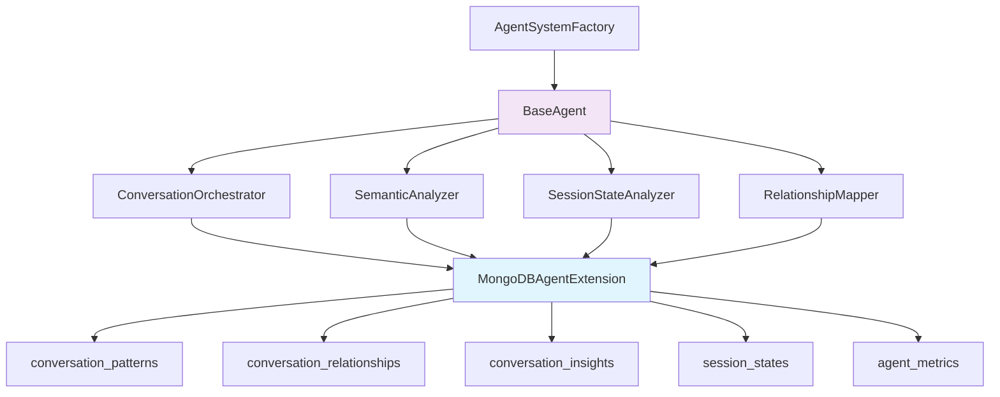

# 🗄️ Database Integration Guide

## Overview

El sistema de agentes está completamente integrado con MongoDB y Redis para persistencia y análisis de datos. Esta integración permite a los agentes:

- ✅ **Almacenar patrones detectados** para reutilización futura
- ✅ **Mapear relaciones** entre conversaciones
- ✅ **Generar insights** persistentes
- ✅ **Monitorear estados** de sesiones
- ✅ **Rastrear métricas** de performance

## Architecture



## Database Collections

### 🔄 `conversation_patterns`
Almacena patrones detectados para reconocimiento automático:

```javascript
{
  pattern_id: "error_404_api",
  title: "API 404 Error Pattern",
  pattern_type: "error", 
  category: "technical",
  frequency: 15,
  confidence: 0.85,
  keywords: ["404", "not found", "api", "endpoint"],
  common_solution: "Check endpoint URL and verify API documentation",
  example_sessions: ["sess_001", "sess_045"],
  created_at: ISODate("2024-01-15T10:30:00Z")
}
```

### 🔗 `conversation_relationships`
Mapea conexiones entre conversaciones:

```javascript
{
  relationship_id: "rel_001",
  source_session: "sess_001",
  target_session: "sess_045", 
  relationship_type: "similar_issue",
  confidence_score: 0.92,
  similarity_score: 0.87,
  evidence: ["Same API endpoint", "Similar error message"],
  created_at: ISODate("2024-01-15T11:00:00Z")
}
```

### 💡 `conversation_insights`
Guarda insights generados por análisis:

```javascript
{
  insight_id: "insight_001",
  source_session: "sess_001",
  insight_type: "recommendation",
  priority: "high",
  title: "Frequent API Documentation Issues",
  description: "Users consistently struggle with endpoint documentation",
  recommendations: [
    {
      action: "Update API documentation with more examples",
      priority: "high",
      estimated_impact: "Reduce 30% of support tickets"
    }
  ],
  confidence: 0.88,
  status: "new"
}
```

### 📊 `session_states`
Rastrea estados de sesiones para documentación:

```javascript
{
  session_id: "sess_001",
  project_name: "e-commerce-api",
  current_state: "completed",
  state_confidence: 0.91,
  documentation_ready: true,
  documentation_value: 85,
  completion_indicators: ["thanks", "working now"],
  complexity_level: "high",
  last_activity: ISODate("2024-01-15T12:30:00Z")
}
```

### 📈 `agent_metrics`
Métricas de performance del sistema de agentes:

```javascript
{
  agent_name: "SemanticAnalyzer",
  metric_type: "performance", 
  metric_name: "response_time",
  value: 245,
  unit: "ms",
  operation_type: "semantic_analysis",
  session_id: "sess_001",
  success: true,
  timestamp: ISODate("2024-01-15T13:00:00Z")
}
```

## Agent Database Access

### Dependency Injection

Los agentes reciben acceso a la base de datos a través de dependency injection:

```javascript
// Automático al inicializar el sistema
agentSystem.injectDependencies({ 
  mongodb: mongoDbInstance, 
  redis: redisInstance 
});

// En cualquier agente (hereda de BaseAgent)
class MyAgent extends BaseAgent {
  async execute(request) {
    // Acceso directo a MongoDB
    const patterns = await this.dependencies.mongodb.findPatterns({
      pattern_type: 'error',
      frequency: { $gte: 5 }
    });
    
    // Acceso a colecciones específicas
    await this.dependencies.mongodb.insertInsight({
      insight_type: 'recommendation',
      title: 'My Generated Insight',
      confidence: 0.85
    });
  }
}
```

### Available Database Methods

#### Pattern Operations
```javascript
// Insertar nuevo patrón
await mongodb.insertPattern(patternData);

// Buscar patrones
await mongodb.findPatterns({ pattern_type: 'error' });

// Actualizar frecuencia
await mongodb.incrementPatternFrequency('pattern_id');
```

#### Relationship Operations  
```javascript
// Crear relación
await mongodb.insertRelationship(relationshipData);

// Buscar relaciones bidireccionales
await mongodb.findBidirectionalRelationships(session_id);
```

#### Insight Operations
```javascript
// Generar insight
await mongodb.insertInsight(insightData);

// Obtener insights activos
await mongodb.getActiveInsights(['project1'], 'high');
```

#### Session State Operations
```javascript
// Actualizar estado de sesión
await mongodb.upsertSessionState(stateData);

// Obtener candidatos para documentación
await mongodb.getDocumentationCandidates(70);
```

#### Metrics Operations
```javascript
// Registrar métrica
await mongodb.insertMetric({
  agent_name: 'SemanticAnalyzer',
  metric_type: 'performance',
  metric_name: 'token_usage',
  value: 125
});

// Métricas agregadas
await mongodb.getAggregatedMetrics('SemanticAnalyzer', 'response_time', 24);
```

## Indexing Strategy

### Performance Optimized Indexes

**Conversation Patterns:**
- `{ pattern_type: 1, frequency: -1 }` - Patrones por tipo y frecuencia
- `{ keywords: 1 }` - Búsqueda por palabras clave
- `{ title: "text", description: "text" }` - Búsqueda de texto completo

**Relationships:**
- `{ source_session: 1, relationship_type: 1 }` - Relaciones por sesión
- `{ confidence_score: -1, quality_score: -1 }` - Calidad de relaciones
- `{ source_session: 1, target_session: 1 }` - Pares únicos

**Insights:**
- `{ priority: -1, confidence: -1 }` - Insights por prioridad
- `{ status: 1, expires_at: 1 }` - Insights activos

**Session States:**
- `{ session_id: 1 }` - Acceso único por sesión
- `{ documentation_ready: 1, documentation_value: -1 }` - Candidatos documentación

## TTL (Time To Live) Configuration

### Automatic Cleanup

- **Patterns**: 90 días sin actividad → eliminación automática
- **Insights**: Campo `expires_at` personalizable (30 días default)
- **Metrics**: 30 días → eliminación automática
- **Relationships**: Sin TTL (persistencia permanente)
- **Session States**: Sin TTL (historial importante)

### Manual Cleanup

```javascript
// Limpieza manual de datos expirados
const results = await mongodb.cleanupExpiredData();
console.log('Cleanup results:', results);
// Output: { expired_insights: 45, old_metrics: 1250 }
```

## Usage Examples

### Pattern Detection & Storage

```javascript
class PatternDetector extends BaseAgent {
  async detectAndStorePattern(conversations) {
    // Analizar conversaciones para detectar patrón
    const pattern = this.analyzePattern(conversations);
    
    if (pattern.confidence > 0.8) {
      // Almacenar patrón en MongoDB
      await this.dependencies.mongodb.insertPattern({
        pattern_id: `pattern_${Date.now()}`,
        title: pattern.title,
        pattern_type: 'error',
        keywords: pattern.keywords,
        frequency: 1,
        confidence: pattern.confidence,
        example_sessions: conversations.map(c => c.session_id)
      });
      
      console.log(`📊 New pattern stored: ${pattern.title}`);
    }
  }
}
```

### Relationship Mapping

```javascript
class RelationshipAnalyzer extends BaseAgent {
  async mapSessionRelationships(session_id) {
    // Buscar sesiones similares
    const candidates = await this.findSimilarSessions(session_id);
    
    for (const candidate of candidates) {
      const similarity = await this.calculateSimilarity(session_id, candidate.id);
      
      if (similarity > 0.7) {
        // Almacenar relación
        await this.dependencies.mongodb.insertRelationship({
          relationship_id: `rel_${Date.now()}`,
          source_session: session_id,
          target_session: candidate.id,
          relationship_type: 'similar_issue',
          confidence_score: similarity,
          evidence: candidate.evidence
        });
      }
    }
  }
}
```

### Insight Generation

```javascript
class InsightGenerator extends BaseAgent {
  async generateInsights(analysis_result) {
    const insights = this.extractInsights(analysis_result);
    
    for (const insight of insights) {
      await this.dependencies.mongodb.insertInsight({
        insight_id: `insight_${Date.now()}`,
        source_session: analysis_result.session_id,
        insight_type: 'recommendation',
        priority: insight.priority,
        title: insight.title,
        description: insight.description,
        recommendations: insight.actions,
        confidence: insight.confidence,
        affected_projects: [analysis_result.project]
      });
    }
    
    console.log(`💡 Generated ${insights.length} insights`);
  }
}
```

## Performance Considerations

### Query Optimization
- **Usa proyecciones** para limitar campos retornados
- **Aprovecha índices** para queries frecuentes  
- **Agrupa operaciones** en batches cuando sea posible
- **Implementa paginación** para resultados grandes

### Memory Management
- **Cache resultados** de patterns frecuentemente usados
- **Limita tamaño** de arrays en documentos
- **Usa TTL** para cleanup automático
- **Monitora métricas** de memoria y performance

### Best Practices
- **Valida datos** antes de insertar
- **Usa transacciones** para operaciones críticas
- **Implementa retry logic** para fallos temporales
- **Registra métricas** para monitoreo

---

## Configuration

### Environment Variables

```bash
# Configuración de MongoDB para agentes
AGENT_MONGODB_COLLECTION_PREFIX=agent_
AGENT_MONGODB_INDEX_CREATION=true
AGENT_PERSISTENT_DATA_TTL_DAYS=90

# Configuración de performance
AGENT_CACHE_TTL_SECONDS=300
AGENT_MAX_CONCURRENT_ANALYSIS=5
AGENT_BATCH_PROCESSING_SIZE=10
```

### Validation

El sistema incluye validadores automáticos para cada tipo de documento:

```javascript
import { SchemaValidators } from './database/agent-schemas.js';

// Validar antes de insertar
if (!SchemaValidators.validatePattern(patternData)) {
  throw new Error('Invalid pattern structure');
}
```

---

**✅ El sistema de agentes ahora tiene persistencia completa con MongoDB, permitiendo aprendizaje continuo y análisis histórico de conversaciones.**