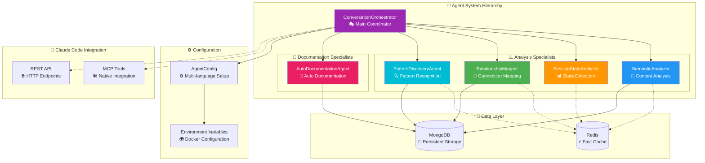
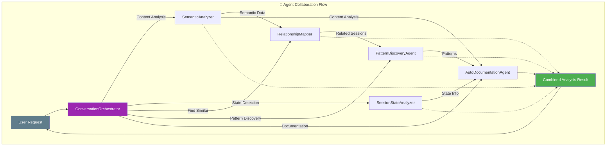

# 🤖 Claude Conversation Logger - Advanced Agent System

## Overview

Advanced agent system for intelligent analysis, automatic documentation, and semantic search of conversations. Provides deep understanding of conversation content and relationship mapping between sessions.

## 🌟 Features

### 🧠 **Deep Semantic Analysis**
- Real understanding of conversation content
- Multi-layer analysis: structural, semantic, temporal
- Intention and topic detection
- Entity and pattern extraction

### 🔍 **Pattern Detection**
- Automatic identification of recurring problems
- Clustering of similar conversations
- Predictive trend analysis
- Generation of actionable insights

### 📝 **Intelligent Auto-Documentation**
- Automatic documentation generation
- Extraction of reusable knowledge patterns
- Automatic categorization by topics
- Token efficiency optimization

### 🔗 **Relationship Mapping**
- Connections between related conversations
- Detection of follow-ups and duplicates
- Shared context analysis
- Advanced thematic clustering

### 🌍 **Multi-Language Support**
- Flexible language configuration
- Mixed Spanish/English detection
- Customizable patterns via Docker
- Automatic cultural adaptation

### ⚡ **Token-Optimized**
- Maximum token usage efficiency
- Multi-level intelligent cache
- Incremental analysis
- Configurable budgets per operation

## 🏗️ Architecture



## 🚀 Quick Start

### Installation

```bash
# The system installs automatically with the conversation logger
cd claude-conversation-logger
npm install

# Agents are in src/agents/ and load automatically
```

### Basic Usage

```javascript
import { ConversationOrchestrator } from './src/agents/core/ConversationOrchestrator.js';
import AgentConfig from './src/agents/config/AgentConfig.js';

// Initialize with configuration
const config = new AgentConfig();
const orchestrator = new ConversationOrchestrator(config);

// Process a request
const result = await orchestrator.processRequest({
  type: 'document_session',
  data: {
    session_id: 'abc123'
  },
  options: {
    includeRelationships: true,
    generateInsights: true
  }
});

console.log(result);
```

### Docker Configuration

```yaml
# docker-compose.yml
services:
  conversation-logger:
    environment:
      # === LANGUAGE CONFIGURATION ===
      AGENT_PRIMARY_LANGUAGE: "es"
      AGENT_SECONDARY_LANGUAGE: "en"
      AGENT_MIXED_LANGUAGE_MODE: "true"
      
      # Keywords (JSON arrays)
      AGENT_WRITE_KEYWORDS: '["documentar","guardar","document","save"]'
      AGENT_READ_KEYWORDS: '["buscar","encontrar","search","find"]'
      AGENT_RESOLUTION_KEYWORDS: '["resuelto","solucionado","resolved","fixed"]'
      AGENT_PROBLEM_KEYWORDS: '["error","problema","bug","issue"]'
      
      # === FEATURE FLAGS ===
      AGENT_ENABLE_SEMANTIC_ANALYSIS: "true"
      AGENT_ENABLE_AUTO_DOCUMENTATION: "true"
      AGENT_ENABLE_RELATIONSHIP_MAPPING: "true"
      
      # === PERFORMANCE TUNING ===
      AGENT_MAX_TOKEN_BUDGET: "100"
      AGENT_SIMILARITY_THRESHOLD: "0.75"
      AGENT_CACHE_TTL_SECONDS: "300"
```

## 📊 Agent Types

### 🎭 **ConversationOrchestrator**
**Role**: Main coordinator that makes intelligent decisions

**When to use**:
- ✅ Entry point for all complex requests
- ✅ Analysis requiring multiple agents
- ✅ Decisions about which agent to use

**Capabilities**:
- Multi-factor analysis for decision making
- Coordination of specialized sub-agents
- Resource optimization (tokens, time)
- Execution plan generation

### 🧠 **SemanticAnalyzer**
**Role**: Deep analysis of conversation content

**When to use**:
- ✅ Conversations with complex technical content
- ✅ Topic and entity detection
- ✅ Analysis of coherence and topic drift
- ✅ Knowledge pattern extraction

**Capabilities**:
- Structural analysis (messages, code, errors)
- Semantic analysis (topics, entities, key phrases)
- Intention and sentiment detection
- Temporal pattern analysis

### 📊 **SessionStateAnalyzer**
**Role**: Intelligent determination of session states

**When to use**:
- ✅ Identify completed vs active sessions
- ✅ Determine when to document
- ✅ Detect abandonment or confusion
- ✅ Evaluate conversation quality

**Capabilities**:
- Temporal activity analysis
- Content pattern detection
- Problem resolution evaluation
- Conversation quality assessment

### 🔗 **RelationshipMapper**
**Role**: Advanced mapping of relationships between conversations

**When to use**:
- ✅ Find similar conversations
- ✅ Detect follow-ups and duplicates
- ✅ Clustering by related topics
- ✅ Context sharing analysis

**Capabilities**:
- Multi-dimensional similarity analysis
- Relationship type detection
- Automatic conversation clustering
- Relationship insight generation

### 🔍 **PatternDiscoveryAgent**
**Role**: Discovery of recurring patterns in historical conversations

**When to use**:
- ✅ Identify recurring problems and solutions
- ✅ Analyze temporal trends and patterns
- ✅ Generate predictive insights
- ✅ Track solution effectiveness over time

**Capabilities**:
- Frequency analysis of problems and solutions
- Temporal trend detection
- Technology-specific pattern analysis
- User behavior pattern recognition

### 📝 **AutoDocumentationAgent**
**Role**: Automatic generation of high-quality documentation

**When to use**:
- ✅ Generate documentation from completed sessions
- ✅ Create structured problem-solution documents
- ✅ Export conversation insights in multiple formats
- ✅ Produce reusable knowledge base content

**Capabilities**:
- Markdown and JSON documentation generation
- Template-based content structuring
- Code example optimization
- Cross-reference and metadata generation

## 🎯 Usage Patterns

### 📝 **Auto-Documentation**
```javascript
// Document completed session automatically
const result = await orchestrator.processRequest({
  type: 'document_session',
  data: { session_id: 'completed_session_123' },
  options: {
    autoDetectPatterns: true,
    includeCodeSamples: true,
    generateTags: true
  }
});

// Result: Generated markdown document + insights
```

### 🔍 **Pattern Discovery**
```javascript
// Detect patterns in recent conversations
const patterns = await orchestrator.processRequest({
  type: 'analyze_patterns',
  data: { timeRange: 7, minFrequency: 3 },
  options: {
    projects: ['front_admin_panel', 'back_commerce'],
    includeResolutions: true
  }
});

// Result: Identified patterns + frequency + solutions
```

### 🔗 **Relationship Discovery**
```javascript
// Find related conversations
const related = await orchestrator.processRequest({
  type: 'find_relationships',
  data: { session_id: 'current_issue_456' },
  options: {
    maxResults: 10,
    minConfidence: 0.7,
    includeInsights: true
  }
});

// Result: Related conversations + relationship type + confidence
```

### 📊 **Deep Analysis**
```javascript
// Deep analysis of complex conversation
const analysis = await orchestrator.processRequest({
  type: 'deep_analysis',
  data: { session_id: 'complex_debug_789' },
  options: {
    includeSemanticAnalysis: true,
    includeRelationships: true,
    generateInsights: true,
    maxTokenBudget: 150
  }
});

// Result: Complete analysis + insights + recommendations
```

## 📈 Performance Metrics

### 🎯 **Token Efficiency**
- **Average per analysis**: 60-80 tokens
- **Complex analysis**: <150 tokens
- **Automatic documentation**: 40-60 tokens
- **Relationship search**: 30-50 tokens

### ⚡ **Speed Benchmarks**
- **Semantic analysis**: 500-1500ms
- **State detection**: 200-500ms
- **Relationship mapping**: 800-2000ms
- **Complete coordination**: 1000-3000ms

### 🎯 **Accuracy Metrics**
- **Pattern detection**: >85% accuracy
- **State determination**: >90% accuracy
- **Relationship mapping**: >80% accuracy
- **Documentation quality**: >85% relevance

## 🔧 Configuration

All configuration is handled through environment variables in Docker Compose.

### 📚 **Detailed Documentation**:
- **[CONFIGURATION.md](./CONFIGURATION.md)** - Complete configuration guide
- **[API.md](./API.md)** - Complete API reference
- **[EXAMPLES.md](./EXAMPLES.md)** - Advanced usage examples

## 🚨 **Important Notes**

### ✅ **Do's**
- ✅ Use the Orchestrator as main entry point
- ✅ Configure languages correctly in Docker
- ✅ Set appropriate thresholds for your use case
- ✅ Monitor token usage metrics
- ✅ Clean caches periodically

### ❌ **Don'ts**
- ❌ Don't call specialized agents directly
- ❌ Don't use heavy analysis on simple sessions
- ❌ Don't ignore performance configurations
- ❌ Don't overload system with simultaneous requests

## 🤝 Agent Relationships & Collaboration

### **🎭 Orchestrator-Driven Hierarchy**

The agent system follows a **hierarchical orchestration pattern** where the ConversationOrchestrator acts as the main coordinator, deciding which specialized agents to activate based on the request type.



### **🔗 Agent Collaboration Patterns**

#### **Pattern 1: Complete Analysis Chain**
```javascript
// Request: "Analyze this troubleshooting conversation comprehensively"
ConversationOrchestrator → SemanticAnalyzer → SessionStateAnalyzer → RelationshipMapper → AutoDocumentationAgent

// Flow:
1. SemanticAnalyzer: Extract topics, entities, technical details
2. SessionStateAnalyzer: Determine if problem was resolved
3. RelationshipMapper: Find similar troubleshooting sessions
4. AutoDocumentationAgent: Generate structured problem-solution doc
```

#### **Pattern 2: Pattern Discovery with Context**
```javascript
// Request: "What are common API authentication issues?"
ConversationOrchestrator → PatternDiscoveryAgent → SemanticAnalyzer → RelationshipMapper

// Flow:
1. PatternDiscoveryAgent: Identify recurring authentication patterns
2. SemanticAnalyzer: Validate semantic consistency of patterns
3. RelationshipMapper: Group related authentication conversations
```

#### **Pattern 3: Smart Documentation Generation**
```javascript
// Request: "Document this implementation session"
ConversationOrchestrator → SessionStateAnalyzer → SemanticAnalyzer → AutoDocumentationAgent

// Flow:
1. SessionStateAnalyzer: Confirm session completion and quality
2. SemanticAnalyzer: Extract key technical content and code examples
3. AutoDocumentationAgent: Generate structured implementation guide
```

### **🧠 Agent Communication & Data Sharing**

#### **Shared Context Objects**
Agents communicate through structured context objects:

```javascript
const sharedContext = {
  session_id: "sess_12345",
  semantic_analysis: {
    topics: ["authentication", "JWT", "API security"],
    entities: ["Express.js", "MongoDB", "Redis"],
    sentiment: "frustrated_to_satisfied",
    complexity: "intermediate"
  },
  session_state: {
    status: "completed",
    resolution_confidence: 0.89,
    quality_score: 0.85
  },
  relationships: [
    { session_id: "sess_11234", similarity: 0.82, type: "similar_problem" },
    { session_id: "sess_11567", similarity: 0.74, type: "related_solution" }
  ],
  patterns: {
    recurring_issue: "JWT token expiration",
    frequency: 23,
    solution_success_rate: 0.94
  }
};
```

#### **Agent Dependencies**
- **SemanticAnalyzer** → Provides content analysis for RelationshipMapper and AutoDocumentationAgent
- **SessionStateAnalyzer** → Provides completion status for AutoDocumentationAgent
- **RelationshipMapper** → Uses SemanticAnalyzer output for similarity calculations
- **PatternDiscoveryAgent** → Collaborates with SemanticAnalyzer for pattern validation
- **AutoDocumentationAgent** → Consumes output from all other agents for comprehensive docs

### **⚡ Parallel vs Sequential Execution**

#### **Parallel Execution (Token Efficient)**
```javascript
// Independent analyses can run in parallel
ConversationOrchestrator.executeParallel([
  SemanticAnalyzer,
  SessionStateAnalyzer,
  PatternDiscoveryAgent  // Uses historical data, doesn't need current analysis
]);
```

#### **Sequential Execution (Context Dependent)**
```javascript
// Dependent analyses run sequentially
1. SemanticAnalyzer.analyze(conversation)
2. RelationshipMapper.findSimilar(semantic_results)
3. AutoDocumentationAgent.generate(all_previous_results)
```

---

## 🤝 Integration

### **With MCP Server**
```javascript
// Agents integrate automatically with MCP server
// 5 New MCP tools available in Claude Code:
- search_conversations          // Intelligent conversation search
- get_recent_conversations     // Latest activity with context
- analyze_conversation_patterns // Pattern detection and analysis
- export_conversation          // Multi-format export (JSON/Markdown)
- analyze_conversation_intelligence // Complete agent-powered analysis
```

### **With API Server**
```javascript
// 6 New agent-powered endpoints:
POST /api/conversations/search      // Advanced search with semantic analysis
GET  /api/conversations/recent      // Context-aware recent conversations
POST /api/conversations/export     // Multi-format export with agent processing
POST /api/conversations/patterns   // Pattern analysis and insights
GET  /api/conversations/:id/analysis // Complete conversation analysis
POST /api/conversations/relationships // Relationship mapping between sessions
```

### **With Database**
```javascript
// 5 New MongoDB collections for agent data:
- conversation_patterns      // Recurring patterns and solutions
- conversation_relationships // Session connections and similarities
- conversation_insights      // Generated insights and analysis
- conversation_states        // Session state tracking
- agent_analytics           // Agent performance and usage metrics
```

## 🎓 **Learning Resources**

- **[🚀 Usage Guide](./USAGE_GUIDE.md)** - Complete Claude Code integration guide
- **[⚡ Quick Reference](./QUICK_REFERENCE.md)** - Commands, triggers, and troubleshooting
- **[🔌 MCP Integration](./MCP_INTEGRATION.md)** - MCP server setup and configuration
- **[🔧 Configuration Guide](./CONFIGURATION.md)** - Advanced configuration options
- **[💾 Database Integration](./DATABASE_INTEGRATION.md)** - Data schemas and persistence

---

## 🏷️ **Metadata**

- **Version**: 2.0.0
- **Compatibility**: Node.js 18+
- **Dependencies**: MongoDB, Redis
- **License**: Private - UniCorp
- **Maintainer**: UniCorp Development Team

**🎯 Built for intelligent conversation analysis with maximum token efficiency and multi-language support.**